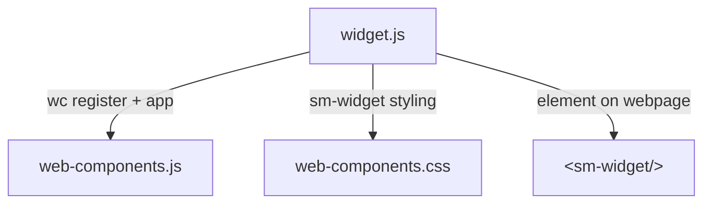
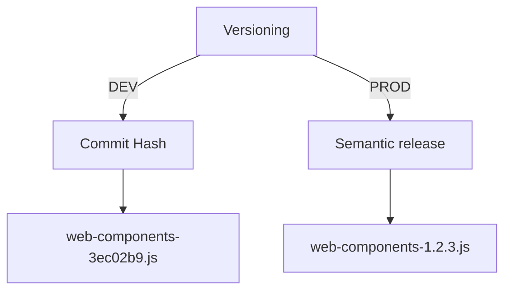

# Web Components

## Contents

- [About the project](#about-the-project)
- [Installation](#installation)
- [Helpful commands](#commands)
- [Styling](#styling)
- [Registering web components](#registering-web-components)
- [Widget snippet](#widget-snippet)
- [Deployment](#deployment)
- [Debugging](#debugging)
- [Linking to local version of Web SDK](#linking-to-a-local-version-of-the-web-sdk)

## About the project

The aim of the web components is to allow for easy integration of a Digital Person into any website. We have two main types of users, a developer and a non tech person.

To support these two different types of users we out two different scripts.

The first is a script called `web-components.js`. Once added to a web page you'll be able to use our custom html elements `<sm-video />` and `<sm-widget />`.

The second script is `widget-snippet.js`, it's goal is to be a low code solution. This is our main focus currently and what users from DDNA Studio will copy. They will paste this script into their webpage and it will inject:

- The web components script
- A css file for styling
- The html for the `<sm-widget />`



**Tooling**

- [Preact](https://preactjs.com/) for composing the UI
- [React Spring](https://react-spring.io/) for UI animations
- [Vite](https://vitejs.dev/) for bundling the code
- [Eslint](https://eslint.org/) for finding and fixing code issues
- [Prettier](https://prettier.io/) for code formatting
- [Storybook](https://storybook.js.org/) for building and previewing components
- [Jest](https://jestjs.io/) for the test runner
- [Testing Tools](https://testing-library.com/) for testing utils
- [Plop](https://plopjs.com/) for generating files and folders

## Installation

Copy the `.env.template` file and rename it to `.env`.

### Using the correct node version

Most of the team uses (nvm)[https://github.com/nvm-sh/nvm], which allows you to switch node versions quickly. You can see what node version to use by looking at our `.nvmrc` file.

You can setup your terminal to switch node versions automatically based on the node version. The docs have (illustrate)[https://github.com/nvm-sh/nvm#deeper-shell-integration]how to do it. If you don't want to setup automatic switching and you use `nvm`, you can type `nvm use` and it will switch to the correct node version. You'll see the automatic node switching working when you navigate into the folder. A message will appear "Now using node v16.14.2 (npm v8.5.0)". If you see something like this "You need to run "nvm install 16.14.2" to install it before using it." you'll need to run the command to install the node version.

### Connecting via an API Key

When working locally you'll need an api key to connect to a digital person.

#### Creating an API Key

**Prerequisites**

- You have created a project in DDNA Studio dev.
- You are connected to the full vpn

**Steps**

- Visit the (create api key page)[https://studio-dev.soulmachines.cloud/api-keys/create] in studio
- Give your key a memorable name, eg: Web Component Local Development
- Pick "web" for the scope
- Select your project
- Tick "I'm developing locally"
- Enter your IP address and subnet mask. Make sure you are on the VPN when doing this.

  - Find your IP address by running this command in your terminal `curl ifconfig.me && echo`
  - Most likely your subnet mask is 32

- Enter the domains that the api keys are allowed to be used.
  - To cover our local html files and storybook, enter `http://localhost:6006` and `http://localhost:3000`
- Select an expiry
- Publish
- Copy your api key and open your `.env` file. Paste your api key as the value of `VITE__PROJECT_API_KEY=`

### Connecting via a Token Server

To connect to a custom token server add the full endpoint to `VITE_TOKEN_SERVER=` in your `.dotenv` file.

## Commands

### Local development

Start Dev Server with Live Reload:

- `npm run start`

Build and Server Code Snippet (Prerequisite for Cypress):

- `npm run build` to compile the scripts and build the snippet
- `npm run serve-snippet` to start a server and serve the snippet code

Run Cypress Test:

- `npm run cypress:open` to open cypress browser

#### Storybook

- `npm run storybook` to start storybook

### Linting

- `npm run lint` to run eslint over the files
- `npm run prettier` to verify files are formatted
- `npm run prettier:fix` to auto format files

### Unit testing

- `npm run test` to run the test suite in watch mode
- `npm run test:ci` to run the tests just once

**Helpful links**

- (Common mistakes)[https://kentcdodds.com/blog/common-mistakes-with-react-testing-library]
- (Learning)[https://testing-library.com/docs/learning]

### Cypress

It's best to use a (selector)[https://docs.cypress.io/guides/references/best-practices#Selecting-Elements] that is not brittle. You can use data attributes to select elements. These may need to be setup for the component. Look at the `<Text />` as an example. We use a data attribute that looks like `data-sm-cy="yourSelector"`. This allows you to write selectors in your test like `cy.get('[data-sm-cy=yourSelector]').click()`. A nice side effect of this is that consumers of the web component can also target these selectors in CSS if they wish.

### Generating Components

Run `npm run generate` in your terminal and it will ask you what you'd like the component to be called. Enter the name and it will scaffold the files in the component directory.

## Styling

(Tailwind)[https://tailwindcss.com/] is setup and used to style the web components. All tailwind styles are under a `sm-` prefix, to avoid naming collisions.

It compiles multiple css files for each entry point. This is so that someone can use the `sm-video` component, without inherting the `sm-widget` styles.

Our theme is using css variables with defaults. Users can choose to override our styles with their own.

### Sizing

By default Tailwind uses `rem` which has some benefits over pixel sizing. Such as scaling up content nicely when the zoom is increased, which is great for accessibility. Unfortunately `rem` sizing is based off the `html` element. Our styles assume the font-size on the `html` element is `16px`. The web component can be embedded on any website and the website may have changed the font size on `html` element to another value(eg: 10px is common). This would make our web component appear at a different size than we expect.

Tailwind currently only supports `rem`. To work around this i've added a postcss plugin which converts all `rem` values to `px`. Postcss works by running scripts against your compiled css. In future we can stick with `rem` if we want or switch to another sizing in Tailwind supports it.

### CSS Reset

Tailwind includes a (global css reset)[https://tailwindcss.com/docs/preflight]. We've disabled this as it will collide with the users website and potentially change the rendering of their UI. Tailwind does not support scoping it. To get around this we've copied across the css reset and prefixed it with `sm-widget`. This way we get the reset styles but it is scoped to our code.

### Local development

Setup your (editor)[https://tailwindcss.com/docs/editor-setup] with the Tailwind extension for autocompletion. For VSCode the extension is called Tailwind CSS IntelliSensePreview. By default it will only work when you are within `class=""` or `className=""`. We are using a npm library called `classNames` to conditionally apply classes. To get autocomplete working within this object you'll need to open your `settings.json` vscode file and add the below snippet.

```
"tailwindCSS.experimental.classRegex": [
  ["classNames\\(([^\\)]*)\\)", "'([^']*)'"]
]
```

## Registering web components

Web components are registered using the [preactement lib](https://github.com/jahilldev/component-elements). You'll find these components in the web-components directory. All files listed in the main `index.ts` will be bundled into the web-components.js script. If this grows in future, we should consider splitting it out into multiple bundles.

## Widget snippet

### How the snippet works

This project creates a bundle for each web component. The javascript bundles can be used directly but require a few of additional steps. The user needs to add the html element to their webpage, add the script/css files and pass through their API key.

To lower the barrier to entry we have created a snippet. The snippet automates the above steps. Upon inserting the script to the page, it will:

- Insert the web component javascript bundle and the stylesheet into the head of the html page
- Insert the web component html element (with <sm-widget> tag) into the page
- Convert options into attributes on the web component html element. These objects can come from a global variable called `window.smConfig` or from data attributes on the script tag.

An example of data attributes.

```
<script
  src="widget-snippet.min.js"
  data-sm-api-key="YOUR_API_KEY"
></script>
```

An example of global variable. This is useful if the user cannot add a <script /> tag to their website and needs to paste in the script.

```
window.smConfig = {
  smApiKey: 'YOUR_API_KEY',
};
<script src="widget-snippet.min.js"></script>
```

The supported config options are:

- `smApiKey` the api key used to access the digital person.
- `smTokenServer` the url for the token server.
- `smProfilePicture` define a custom digital person profile picture.
- `smGreeting` define a custom greeting

### How it is built

1. `npm run build` is run to generate the assets. As part of this process it generates a file called `manifest.json`. This contains the asset names and paths that were generated.
2. There is a file called `build-snippet.js`. This:
   - reads the `manifest.json` file.
   - calls the template generation plugin we are using. The template is called `snippet.js.template`.
   - it takes the template, populating the filenames using the data from the manifest file. It outputs `widget-snippet.js` into the `dist` folder.
   - when the node env is production, it will preprend the asset urls with the CDN name
3. You run the above file by typing `npm run build-snippet`
4. After the file is built, UglifyJS is run to minify it and the minified version is outputted into the dist directory as `widget-snippet.min.js`.

### Running the snippet locally

Run `npm run serve-snippet`. This starts a local server, serving the `dist` folder. It also copies across the html files in `examples/snippet` to the `dist` folder. This is so that the html files can reference the built snippet scripts.

## Deployment

We deploy the bundles via github actions. The bundles are automatically deployed to the dev folder in the CDN, when code is merged in to master. There is a manual trigger which deploys the code to the production CDN.

Helpful urls:

- (Dev snippet)[https://static.soulmachines.com/dev/widget-snippet.min.js`]
- (Production snippet)[https://static.soulmachines.com/widget-snippet.min.js`]

### Versioning

We are using semantic release which creates releases using git tags. As part of our release stable pipeline we have a step to generate a json file which contains all the tags. This is so that it will be deployed to our CDN and we can fetch the file and determine what releases are available.

**Web component**
The web component is built with a environment variable called `VERSION`. Depending on the enviroment it will be a different value:

- Local development it is set to a time stamp
- Dev it is set to the commit hash
- Prod it is set to the semantic release version

The built file name will look like this `web-components-<version-number-here>.js`

**Snippet**

We'll always deploy a latest version of the snippet to use. As part of the production release we'll copy the latest files and rename them to a specific version that we get from semantic release. Say we were release version 1.5, you'd find these files in the CDN

```
dist/widget-snippet.js
dist/widget-snippet.min.js
dist/widget-snippet-1.5.0.js
dist/widget-snippet-1.5.0.min.js
```



## Debugging

We log the version of the widget to the console. This means if a user reports an issue with the widget, you can ask them to tell you what version they are using.

## Linking to a local version of the Web SDK

Sometimes it's helpful to link to your local smwebsdk repo when debugging an issue. There are a few steps you need to do. These instructions assume you have the websdk repo checked out locally.

### Linking

1. In your terminal navigate to the websdk folder and run `npm link`
2. Run `npm run watch` to start watching the sdk files
3. In a seperate terminal navigate to the sm web component folder
4. Link to your local websdk by running `npm link "@soulmachines/smwebsdk"`
5. Open `vite.config.ts` and add optimizeDeps to the config. This is needed as vite does some special caching locally
   ```
   export default defineConfig({
     optimizeDeps: {
       exclude: ['@soulmachines/smwebsdk'],
     },
     ....
   ```
6. Run `npm run start` and it should be using your local websdk

### Unlinking

1. Remove the `optimizeDeps` object in `vite.config.ts` that you previously added
2. Open your terminal to the sm web component repo and run `npm unlink "@soulmachines/smwebsdk"`
3. Run `npm install`
